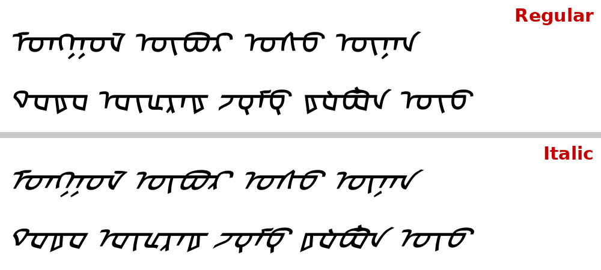

#+title: MongolHorizont
#+subtitle: A horizontal (left-to-right) traditional Mongolian font derived from Noto Sans Mongolian

* Overview

MongolHorizont reshapes the glyphs of Noto Sans Mongolian for horizontal,
left-to-right reading. Traditional Mongolian is designed for vertical
setting; when rendered horizontally, the stem sits low and the letter
bodies hang beneath it. MongolHorizont moves the stem upwards by compressing
only the parts above it, leaving everything below the stem untouched.

The family has two styles:

| Style   | Stem centre (from the top) | Slant         | =italicAngle= |
|---------+----------------------------+---------------+---------------|
| Regular | 1/3.5 of the glyph height  | 10° to right  | −10           |
| Italic  | 1/3.5 of the glyph height  | 30° to right  | −30           |

#+caption: MongolHorizont Regular and Italic (traditional Mongolian above, Todo below)
#+attr_org: :width 700

Coverage is that of Noto Sans Mongolian: traditional Mongolian, Todo, Sibe,
Manchu and Ali Gali (U+1800–U+18AF), plus the Latin glyphs of the source font.

* Design notes

- *Stem position.* The stem (y = 364–444) stays where it is. Everything above
  it is scaled down until the stem centre lies at 1/3.5 of the total glyph
  height; this lowers the top of the glyphs from 1059 to 672 units. Rings,
  teeth and ligatures below the stem keep their original shape.
- *Stroke thickness.* Every outline point is mapped through the centre line
  of its stroke rather than through its own position, so horizontal and
  vertical strokes keep their original thickness.
- *Slant.* A horizontal shear about the stem centre line. The stem is
  horizontal, so the joins between letters stay exact.
- *Advance widths* are those of Noto Sans Mongolian.
- *Vertical metrics* (hhea, OS/2 typo and win) are set to 1160 / −288 with
  no line gap, the values of Noto Sans CJK, so that lines mixing Mongolian
  and Han characters keep the Han line height.
- *Hinting* has been removed, since the TrueType instructions referred to the
  original outlines. Text may look slightly softer at small sizes on Windows.

* Files

| File                          | Purpose                                                       |
|-------------------------------+---------------------------------------------------------------|
| =build.sh=                    | Downloads Noto Sans Mongolian and builds both styles          |
| =horiz.py=                    | Glyph transformation (stem position, slant, metrics sync)     |
| =family.py=                   | Family and style names, style flags, vertical metrics         |
| =install-mongolhorizont.sh=   | User installation and fontconfig defaults                     |
| =render.py=                   | Text preview as PNG                                           |
| =images/preview.png=          | Sample of the final Regular and Italic                        |
| =mono.py= and helpers         | Experimental monospaced variant (see [[*Monospaced variant]])  |

* Building

Requirements: Python 3, =fonttools=, =curl=.

#+begin_src sh
./mongolhorizont-src/build.sh
#+end_src

The fonts are written to =build/=. The parameters are set at the top of
=build.sh=:

| Variable    | Meaning                                                   | Current |
|-------------+-----------------------------------------------------------+---------|
| =MODE=      | 0: stretch below, compress above; 1: as 0 but keep rings; 2: compress above only | 2 |
| =REG_RATIO= | Stem centre depth from the top, Regular                   | 1/3.5   |
| =REG_SLANT= | Slant in degrees, Regular (positive = left, negative = right) | −10 |
| =ITA_RATIO= | Stem centre depth from the top, Italic                    | 1/3.5   |
| =ITA_SLANT= | Slant in degrees, Italic                                  | −30     |

=horiz.py= can also be run on its own:

#+begin_src sh
./mongolhorizont-src/horiz.py SRC.ttf DST.ttf SLANT FAMILY RATIO MODE
#+end_src

* Installation

#+begin_src sh
./mongolhorizont-src/install-mongolhorizont.sh [FONT_DIR]
#+end_src

The script
1. symlinks both font files into =~/.local/share/fonts=;
2. replaces =~/.config/fontconfig/conf.d/60-mongolian.conf= (a time-stamped
   backup of an existing file is kept) with rules that
   - remove the Unifont family from the candidates,
   - prefer MongolHorizont for text tagged =mn-cn=,
   - append MongolHorizont, Noto Sans Mongolian and Mongolian Universal White,
     in this order, to =sans-serif=, =serif= and =monospace=;
3. rebuilds the font cache and checks which font renders U+1820 and which
   renders Latin text.

The fallback chain uses =binding="weak"=. With ="same"= the Mongolian fonts
would inherit the strong binding of the generic names, outrank the Latin
fonts and take over Latin text as well.

After replacing font files later, run =fc-cache -f= and restart the
applications; a plain =fc-cache= may miss in-place changes behind symlinks.

* Usage

** Emacs

Emacs picks MongolHorizont through fontconfig. To pin it explicitly:

#+begin_src emacs-lisp
(set-fontset-font t 'mongolian "MongolHorizont")
#+end_src

Joining requires HarfBuzz shaping; =(frame-parameter nil 'font-backend)=
should include =harfbuzz=. Italic faces use the Italic file automatically.

** LibreOffice

LibreOffice classifies Mongolian as Asian text. Enable Asian language support
(Tools → Options → Language Settings → Languages) and set MongolHorizont as
the /Asian text font/, preferably in the paragraph style. The toolbar font box
sets only one font slot, usually the Western one.

* Monospaced variant (experimental)

=mono.py= derives a monospaced font from an unslanted mode-2 build: one
column (600 units, matching Noto Sans Mono) per character, two columns for
two-character ligatures, zero for variation selectors. Narrow glyphs gain
stem length; wide glyphs lose stem length at both ends and are compressed
only where that is not enough. =probe_k.py= determines how many characters
each glyph stands for (=k.json=), =verify_mono.py= checks the grid on random
words, =preview_mono.py= renders a column grid.

The automatic approach works for most glyphs, but intrinsically wide letters
— such as the initial forms of ö/ü — end up heavily compressed. A usable
monospaced Mongolian needs a modular redesign of these letters rather than
geometric adjustment.

* Licence

Noto Sans Mongolian is licensed under the SIL Open Font License 1.1.
MongolHorizont is a modified version and is distributed under the same
licence. The original copyright notice is retained in the font's =name=
table; the family has been renamed to distinguish it from the original. The
licence text is in =OFL.txt=.
